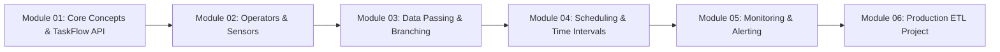

# 🚀 Giáo Trình & Bộ Code Mẫu Toàn Diện Học Apache Airflow

Chào mừng bạn đến với kho tài liệu và mã nguồn thực hành **Apache Airflow** từ cơ bản đến nâng cao. Repository này được thiết kế theo dạng **Module hóa (Modular Learning)** với các ví dụ thực tế có thể chạy được ngay.

---

## 📑 Mục Lục
1. [Lộ Trình Các Module Cần Học](#-lộ-trình-các-module-cần-học)
2. [Cấu Trúc Thư Mục Repository](#-cấu-trúc-thư-mục-repository)
3. [Hướng Dẫn Cài Đặt & Chạy Thử Nghiệm](#-hướng-dẫn-cài-đặt--chạy-thử-nghiệm)
4. [Chi Tiết Từng Module & Mã Nguồn Ví Dụ](#-chi-tiết-từng-module--mã-nguồn-ví-dụ)
5. [Tài Liệu Bổ Trợ Chuyên Sâu](#-tài-liệu-bổ-trợ-chuyên-sâu)
6. [Các Quy Tắc Vàng Khi Viết DAG (Best Practices)](#-các-quy-tắc-vàng-khi-viết-dag-best-practices)

---

## 🎯 Lộ Trình Các Module Cần Học



---

## 📂 Cấu Trúc Thư Mục Repository

```text
.
├── README.md                                  # Hướng dẫn tổng quan và lộ trình học
├── docker-compose.yaml                        # File Docker Compose khởi chạy Airflow Local
├── requirements.txt                           # Thư viện Python phụ trợ
├── .gitignore                                 # Bỏ qua log, cache, db files
├── dags/                                      # Thư mục chứa toàn bộ mã nguồn DAGs
│   ├── 01_basics/                             # Module 01: Khái niệm cốt lõi
│   │   ├── 01_first_dag_classic.py           # DAG viết theo kiểu Classic Operator
│   │   └── 02_taskflow_modern_dag.py         # DAG viết theo TaskFlow API (@dag, @task)
│   ├── 02_operators_sensors/                  # Module 02: Operators & Sensors
│   │   ├── 01_standard_operators.py          # BashOperator, PythonOperator, Jinja Macros
│   │   ├── 02_sensors_demo.py                # PythonSensor (poke vs reschedule)
│   │   └── 03_custom_operator_hook.py        # Tự viết Custom Operator & Hook
│   ├── 03_data_passing_and_branching/         # Module 03: Trao đổi dữ liệu & Phân nhánh
│   │   ├── 01_xcom_data_sharing.py           # XCom push/pull metadata
│   │   ├── 02_variables_connections.py       # Airflow Variables & Secrets Connection
│   │   └── 03_branching_and_dynamic_tasks.py # BranchPythonOperator & Dynamic Task Mapping
│   ├── 04_scheduling_and_time/                # Module 04: Lập lịch & Quản lý thời gian
│   │   ├── 01_scheduling_and_intervals.py    # Logical Date, Data Interval Start/End
│   │   └── 02_backfill_and_catchup.py        # Catchup=False, max_active_runs, depends_on_past
│   ├── 05_monitoring_and_resilience/          # Module 05: Giám sát, Thử lại & Giao diện
│   │   ├── 01_retries_and_callbacks.py       # Retries, On Failure/Success/Retry Callbacks
│   │   └── 02_task_groups_ui.py              # TaskGroup tổ chức giao diện DAG gọn gàng
│   └── 06_production_etl_project/             # Module 06: Dự án Pipeline thực tế
│       ├── etl_production_pipeline.py        # Pipeline hoàn chỉnh: API -> Pandas -> SQLite
│       └── data_quality_checks.py            # Chốt chặn kiểm định chất lượng dữ liệu
├── plugins/                                   # Nơi chứa các custom plugin, hooks, operators
│   └── custom_plugins.py
└── docs/                                      # Tài liệu học chuyên sâu & phỏng vấn
    ├── 01_airflow_architecture.md             # Kiến trúc Webserver, Scheduler, DB, Workers
    ├── 02_executors_comparison.md             # So sánh Local, Celery, Kubernetes Executor
    └── 03_cli_cheatsheet.md                   # Cheatsheet lệnh CLI & Top câu hỏi phỏng vấn
```

---

## ⚡ Hướng Dẫn Cài Đặt & Chạy Thử Nghiệm

### Cách 1: Khởi Chạy Nhanh Bằng Docker Compose (Khuyên dùng)
1. Đảm bảo máy tính đã cài đặt **Docker** và **Docker Compose**.
2. Tại thư mục gốc của repository, chạy lệnh:
   ```bash
   docker-compose up -d
   ```
3. Truy cập Airflow Web UI tại trình duyệt: [http://localhost:8080](http://localhost:8080)
   - **Tài khoản**: `admin`
   - **Mật khẩu**: `admin`
4. Để dừng môi trường:
   ```bash
   docker-compose down
   ```

### Cách 2: Chạy Trực Tiếp Bằng Môi Trường Python (Standalone)
```bash
# Tạo và kích hoạt môi trường ảo
python -m venv .venv
source .venv/bin/activate  # Trên Windows: .venv\Scripts\activate

# Cài đặt thư viện
pip install -r requirements.txt

# Khởi chạy Airflow ở chế độ standalone
airflow standalone
```

---

## 📚 Chi Tiết Từng Module & Mã Nguồn Ví Dụ

### 1️⃣ Module 01: Khái Niệm Cốt Lõi (Airflow Basics)
- [01_first_dag_classic.py](file:///c:/Users/Minh%20Doan/repo_github/Airflow/dags/01_basics/01_first_dag_classic.py): Hướng dẫn khai báo DAG theo phong cách truyền thống với `default_args`, toán tử thiết lập quan hệ phụ thuộc (`>>`, `<<`).
- [02_taskflow_modern_dag.py](file:///c:/Users/Minh%20Doan/repo_github/Airflow/dags/01_basics/02_taskflow_modern_dag.py): Hướng dẫn viết DAG theo phong cách hiện đại **TaskFlow API** (`@dag`, `@task`), tự động truyền dữ liệu qua tham số hàm.

### 2️⃣ Module 02: Operators, Sensors & Custom Plugins
- [01_standard_operators.py](file:///c:/Users/Minh%20Doan/repo_github/Airflow/dags/02_operators_sensors/01_standard_operators.py): Các Operator thường dùng (`BashOperator`, `PythonOperator`, `EmptyOperator`) và cách sử dụng Jinja templating (`{{ ds }}`).
- [02_sensors_demo.py](file:///c:/Users/Minh%20Doan/repo_github/Airflow/dags/02_operators_sensors/02_sensors_demo.py): Cơ chế Sensor chờ sự kiện và tối ưu tài nguyên với `mode='reschedule'`.
- [03_custom_operator_hook.py](file:///c:/Users/Minh%20Doan/repo_github/Airflow/dags/02_operators_sensors/03_custom_operator_hook.py): Hướng dẫn tự tạo Operator kế thừa `BaseOperator`.

### 3️⃣ Module 03: Trao Đổi Dữ Liệu & Phân Nhánh (Data Passing & Branching)
- [01_xcom_data_sharing.py](file:///c:/Users/Minh%20Doan/repo_github/Airflow/dags/03_data_passing_and_branching/01_xcom_data_sharing.py): Sử dụng `ti.xcom_push` và `ti.xcom_pull` để chia sẻ thông tin metadata giữa các task.
- [02_variables_connections.py](file:///c:/Users/Minh%20Doan/repo_github/Airflow/dags/03_data_passing_and_branching/02_variables_connections.py): Quản lý cấu hình toàn cục (Variables) và bảo mật thông tin đăng nhập database (Connections).
- [03_branching_and_dynamic_tasks.py](file:///c:/Users/Minh%20Doan/repo_github/Airflow/dags/03_data_passing_and_branching/03_branching_and_dynamic_tasks.py): Điều hướng luồng bằng `BranchPythonOperator` và sinh task song song linh hoạt qua **Dynamic Task Mapping** (`.expand()`).

### 4️⃣ Module 04: Lập Lịch & Quản Lý Thời Gian (Scheduling & Intervals)
- [01_scheduling_and_intervals.py](file:///c:/Users/Minh%20Doan/repo_github/Airflow/dags/04_scheduling_and_time/01_scheduling_and_intervals.py): Giải mã `logical_date` (execution date) vs `data_interval_start` & `data_interval_end`.
- [02_backfill_and_catchup.py](file:///c:/Users/Minh%20Doan/repo_github/Airflow/dags/04_scheduling_and_time/02_backfill_and_catchup.py): Kiểm soát cơ chế chạy bù quá khứ (`catchup=False`), `max_active_runs` và `depends_on_past`.

### 5️⃣ Module 05: Giám Sát, Thử Lại & Giao Diện (Monitoring & Resilience)
- [01_retries_and_callbacks.py](file:///c:/Users/Minh%20Doan/repo_github/Airflow/dags/05_monitoring_and_resilience/01_retries_and_callbacks.py): Xây dựng cơ chế tự phục hồi với `retries`, exponential backoff và gửi cảnh báo qua `on_failure_callback`.
- [02_task_groups_ui.py](file:///c:/Users/Minh%20Doan/repo_github/Airflow/dags/05_monitoring_and_resilience/02_task_groups_ui.py): Gom nhóm trực quan trên Airflow UI bằng `TaskGroup`.

### 6️⃣ Module 06: Dự Án ETL Thực Tế & Kiểm Định Chất Lượng
- [etl_production_pipeline.py](file:///c:/Users/Minh%20Doan/repo_github/Airflow/dags/06_production_etl_project/etl_production_pipeline.py): Pipeline chuẩn hóa ETL thực tế: Trích xuất đơn hàng -> Làm sạch & Quy đổi tiền tệ Pandas -> Lưu trữ Data Warehouse SQLite.
- [data_quality_checks.py](file:///c:/Users/Minh%20Doan/repo_github/Airflow/dags/06_production_etl_project/data_quality_checks.py): Các chốt chặn kiểm tra tự động phát hiện số liệu âm, bảng trống trước khi đẩy sang Dashboard.

---

## 📖 Tài Liệu Bổ Trợ Chuyên Sâu

- 🏛️ [01_airflow_architecture.md](file:///c:/Users/Minh%20Doan/repo_github/Airflow/docs/01_airflow_architecture.md): Tìm hiểu chi tiết về Webserver, Scheduler, Metadata Database, Workers và Triggerer.
- ⚙️ [02_executors_comparison.md](file:///c:/Users/Minh%20Doan/repo_github/Airflow/docs/02_executors_comparison.md): Phân tích & so sánh 4 loại Executor phổ biến nhất (Sequential, Local, Celery, Kubernetes).
- 💡 [03_cli_cheatsheet.md](file:///c:/Users/Minh%20Doan/repo_github/Airflow/docs/03_cli_cheatsheet.md): Bảng tra cứu các lệnh Airflow CLI thường dùng và bộ câu hỏi phỏng vấn Data Engineer hay gặp.

---

## 🛡️ Các Quy Tắc Vàng Khi Viết DAG (Best Practices)

1. **Tuyệt đối không viết code nặng ở Top-level**: Không gọi Database hay API trực tiếp ngoài phạm vi task vì Scheduler sẽ parse lại file sau mỗi vài giây, gây nghẽn CPU hệ thống.
2. **Đảm bảo tính lũy đạo (Idempotency)**: Khi chạy lại một task/DAG với cùng một khoảng thời gian dữ liệu (`logical_date`), kết quả cuối cùng phải luôn nhất quán và không làm nhân đôi dữ liệu.
3. **Không dùng XCom để truyền dữ liệu lớn**: XCom lưu vào Metadata DB. Chỉ truyền metadata, URL hoặc file path qua XCom. Dữ liệu bảng lớn hãy lưu vào S3/GCS/DWH.
4. **Dùng mode='reschedule' cho Sensor**: Giúp giải phóng worker slot trong thời gian chờ đợi sự kiện.
5. **Luôn đặt catchup=False nếu không có nhu cầu backfill**: Tránh tình trạng Airflow kích hoạt hàng loạt tác vụ quá khứ làm sập hệ thống khi vừa bật DAG.