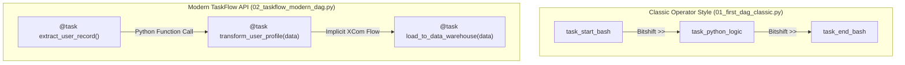

# 📌 Module 01: Airflow Basics & DAG Definition

Module này cung cấp nền tảng kiến thức nhập môn toàn diện về **Apache Airflow**, tập trung vào cách định nghĩa pipeline dữ liệu (DAG - Directed Acyclic Graph) thông qua hai phong cách: **Classic DAG** (Operator truyền thống) và **Modern TaskFlow API** (Airflow 2.x+).

---

## 🎯 Mục Tiêu Học Tập
1. Hiểu kiến trúc cốt lõi và chu trình thực thi của một DAG trong Airflow Scheduler và Worker.
2. Nắm vững cách cấu hình tham số cơ bản: `default_args`, `start_date`, `schedule_interval`, `catchup`, `tags`, `doc_md`.
3. Biết cách sử dụng các Operator cơ bản: `BashOperator`, `PythonOperator`.
4. Thiết lập quan hệ phụ thuộc (Task Dependencies) qua toán tử Bitshift (`>>`, `<<`).
5. Tiếp cận **TaskFlow API** (`@dag`, `@task`) để code ngắn gọn, tự động truyền dữ liệu và dễ bảo trì.
6. Nắm vững kỹ thuật viết tài liệu Markdown nhúng trực tiếp trong Web UI bằng thuộc tính `doc_md`.

---

## 🏗️ Kiến Trúc Luồng Thực Thi



---

## 📂 Danh Sách Files & Chi Tiết Triển Khai

| File | Mô Tả & Khái Niệm Chính | Điểm Cốt Lõi |
| :--- | :--- | :--- |
| [`01_first_dag_classic.py`](file:///c:/Users/Minh%20Doan/repo_github/Airflow/dags/01_basics/01_first_dag_classic.py) | Định nghĩa DAG kiểu truyền thống với Context Manager `with DAG(...) as dag:`, sử dụng `BashOperator`, `PythonOperator`. | Phù hợp khi tích hợp các hệ thống phân tán (Spark, Trino, Bash scripts). |
| [`02_taskflow_modern_dag.py`](file:///c:/Users/Minh%20Doan/repo_github/Airflow/dags/01_basics/02_taskflow_modern_dag.py) | Định nghĩa pipeline theo TaskFlow API với Decorator `@dag` và `@task`. | Code chuẩn Pythonic, tự động quản lý metadata trao đổi qua XCom backend. |

---

## ⚖️ So Sánh Chuyên Sâu: Classic DAG vs. TaskFlow API

| Tiêu Chí | Classic DAG (`01_first_dag_classic.py`) | TaskFlow API (`02_taskflow_modern_dag.py`) |
| :--- | :--- | :--- |
| **Phiên bản hỗ trợ** | Airflow 1.x & 2.x | Airflow 2.0+ (Khuyên dùng) |
| **Cú pháp định nghĩa** | Class-based (`PythonOperator`, `BashOperator`) | Decorator (`@task`, `@dag`) |
| **Truyền nhận dữ liệu** | Thủ công qua `ti.xcom_push()` / `ti.xcom_pull()` | Tự động truyền qua tham số hàm & return value |
| **Type Hinting** | Khó áp dụng cho data flow | Hỗ trợ đầy đủ `typing.Dict`, `typing.Any` |
| **UI Documentation** | Gán qua `doc_md` trên từng operator | Tự động đọc docstring của hàm Python |
| **Trường hợp khuyên dùng** | Tích hợp hệ thống bên ngoài (S3, Spark, Dbt) | Xử lý logic dữ liệu thuần Python (ETL nội bộ) |

---

## ⚠️ Các Cạm Bẫy Cần Tránh (Pitfalls & Anti-Patterns)

1. **Tuyệt đối không chạy code nặng ở Top-Level**:
   - Scheduler liên tục quét các file trong `dags/` mỗi vài giây. Nếu gọi API hay query DB ngoài hàm task, CPU của Scheduler sẽ bị quá tải ngay lập tức.
2. **Luôn đặt `catchup=False` khi mới phát triển**:
   - Mặc định `catchup=True` sẽ khiến Airflow kích hoạt hàng trăm DAG run cho các khoảng thời gian từ `start_date` tới hiện tại.
3. **Sử dụng `default_args` một cách cẩn trọng**:
   - Các thuộc tính trong `default_args` sẽ kế thừa cho tất cả các task. Tránh đặt timeout quá ngắn hoặc retry quá nhiều lần làm nghẽn worker.

---

## 🚀 Hướng Dẫn Kiểm Thử & Thực Thi

### 1. Kiểm tra cú pháp (Syntax Validation)
```bash
python dags/01_basics/01_first_dag_classic.py
python dags/01_basics/02_taskflow_modern_dag.py
```

### 2. Liệt kê các DAG và Task trong CLI
```bash
airflow dags list --tags module_01
airflow tasks list 01_first_dag_classic --tree
airflow tasks list 02_taskflow_modern_dag --tree
```

### 3. Chạy thử một Task đơn lẻ (Dry Run / Test mode)
```bash
# Test task Python trong DAG classic mà không cần chạy toàn bộ DAG
airflow tasks test 01_first_dag_classic task_python_logic 2024-01-01

# Test task Extract trong TaskFlow DAG
airflow tasks test 02_taskflow_modern_dag extract_user_record 2024-01-01
```
