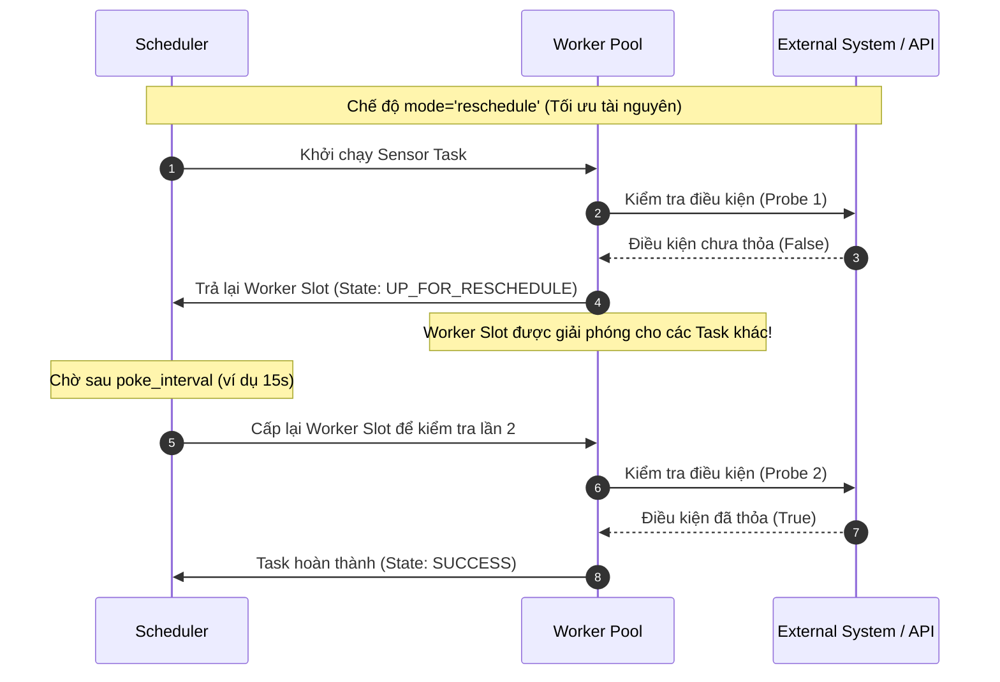

# 📌 Module 02: Operators, Sensors & Custom Extensions

Module này tập trung vào các khối xây dựng cốt lõi (Building Blocks) của Airflow: **Operators chuẩn**, **Sensors theo hướng sự kiện (Event-Driven)** và **Custom Operator tự định nghĩa**.

---

## 🎯 Mục Tiêu Học Tập
1. Sử dụng thành thạo các Operator chuẩn: `BashOperator`, `PythonOperator`, `EmptyOperator`.
2. Ứng dụng **Jinja Templating** và **Airflow Macros** (`{{ ds }}`, `{{ ds_nodash }}`, `{{ dag.dag_id }}`) cùng User-Defined Macros để động hóa cấu hình pipeline.
3. Hiểu cơ chế hoạt động của **Sensors** và sự khác biệt cốt lõi giữa `mode="poke"` vs `mode="reschedule"`.
4. Cấu hình tham số bảo vệ cluster: `timeout`, `exponential_backoff`, `soft_fail`.
5. Tự viết **Custom Operator** kế thừa từ `BaseOperator` có hỗ trợ `template_fields`, `ui_color` và trả dữ liệu metadata vào XCom.

---

## 🏗️ Luồng Hoạt Động & Cơ Chế Sensor



---

## 📂 Danh Sách Files & Chi Tiết Triển Khai

| File | Mô Tả & Khái Niệm Chính | Điểm Cốt Lõi |
| :--- | :--- | :--- |
| [`01_standard_operators.py`](file:///c:/Users/Minh%20Doan/repo_github/Airflow/dags/02_operators_sensors/01_standard_operators.py) | Trình diễn sử dụng `EmptyOperator` làm anchor point, `BashOperator` truyền biến môi trường và Jinja template, `PythonOperator` truyền tham số qua `op_kwargs`. | Sử dụng `user_defined_macros` tùy biến hàm định dạng tiền tệ. |
| [`02_sensors_demo.py`](file:///c:/Users/Minh%20Doan/repo_github/Airflow/dags/02_operators_sensors/02_sensors_demo.py) | Mô hình Event-driven với `PythonSensor`. Thiết lập `poke_interval`, `timeout`, `exponential_backoff=True` và chế độ tối ưu worker `mode="reschedule"`. | Giải phóng slot worker giữa các lần kiểm tra, ngăn chặn cạn kiệt tài nguyên. |
| [`03_custom_operator_hook.py`](file:///c:/Users/Minh%20Doan/repo_github/Airflow/dags/02_operators_sensors/03_custom_operator_hook.py) | Xây dựng class `CleanAndValidateCsvOperator(BaseOperator)` với `template_fields = ("source_name", "partition_date")` và tùy biến giao diện `ui_color`. | Trực tiếp đẩy kết quả kiểm định vào XCom cho task downstream sử dụng. |

---

## 💡 Bảng Tra Cứu Jinja Macros Phổ Biến

| Jinja Macro | Định Dạng Mẫu | Ý Nghĩa Thực Tế |
| :--- | :--- | :--- |
| `{{ ds }}` | `2024-01-01` | Ngày logical date dạng chuỗi YYYY-MM-DD |
| `{{ ds_nodash }}` | `20240101` | Ngày logical date viết liền không dấu gạch nối (tiện đặt tên tệp/bảng) |
| `{{ prev_ds }}` | `2023-12-31` | Chu kỳ dữ liệu trước đó |
| `{{ next_ds }}` | `2024-01-02` | Chu kỳ dữ liệu tiếp theo |
| `{{ dag.dag_id }}` | `01_standard_operators` | ID định danh của chính DAG đang chạy |

---

## 🚀 Hướng Dẫn Kiểm Thử & Thực Thi

### 1. Kiểm tra cú pháp DAG (Syntax Validation)
```bash
python dags/02_operators_sensors/01_standard_operators.py
python dags/02_operators_sensors/02_sensors_demo.py
python dags/02_operators_sensors/03_custom_operator_hook.py
```

### 2. Test Custom Operator trong CLI
```bash
# Thử nghiệm thực thi trực tiếp task Custom Operator với ngày giả lập
airflow tasks test 03_custom_operator_hook validate_sales_data 2024-01-01
```
