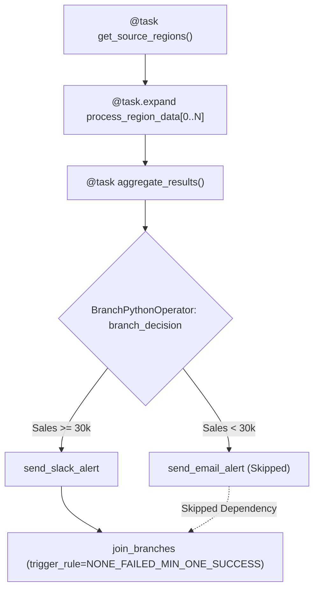

# 📌 Module 03: Data Passing, Variables & Dynamic Branching

Module này bao quát các kỹ thuật truyền nhận dữ liệu giữa các task, quản trị biến cấu hình/kết nối bảo mật, cùng các cơ chế điều hướng luồng động: **XComs**, **Variables & Connections**, **Branching** và **Dynamic Task Mapping**.

---

## 🎯 Mục Tiêu Học Tập
1. Hiểu cơ chế **XCom (Cross-Communication)**: cách trao đổi metadata/small payloads an toàn và tránh anti-pattern truyền dữ liệu lớn (Big Data).
2. Quản lý biến môi trường với **Airflow Variables** và kết nối bí mật với **Airflow Connections** đúng chuẩn performance (tránh Top-Level Code SQL queries).
3. Triển khai phân nhánh logic động với **`BranchPythonOperator`** và xử lý điểm hội tụ bằng **`TriggerRule`** phù hợp.
4. Tận dụng sức mạnh của **Dynamic Task Mapping (`@task.expand`)** trong Airflow 2.3+ để xử lý dữ liệu song song theo danh sách phần tử động.

---

## 🏗️ Sơ Đồ Phân Nhánh & Dynamic Task Mapping



---

## 📂 Danh Sách Files & Chi Tiết Triển Khai

| File | Mô Tả & Khái Niệm Chính | Điểm Cốt Lõi |
| :--- | :--- | :--- |
| [`01_xcom_data_sharing.py`](file:///c:/Users/Minh%20Doan/repo_github/Airflow/dags/03_data_passing_and_branching/01_xcom_data_sharing.py) | Đẩy và kéo dữ liệu qua `ti.xcom_push(key, value)` và `ti.xcom_pull(task_ids, key)`. Thể hiện mô hình Producer -> Consumer cho metadata & metrics. | Hạn chế payload kích thước lớn, ưu tiên lưu đường dẫn storage. |
| [`02_variables_connections.py`](file:///c:/Users/Minh%20Doan/repo_github/Airflow/dags/03_data_passing_and_branching/02_variables_connections.py) | Đọc `Variable.get()` an toàn trong runtime của task và lấy thông tin connection qua `BaseHook.get_connection()`. | Hỗ trợ JSON deserialization và bảo vệ thông tin mật. |
| [`03_branching_and_dynamic_tasks.py`](file:///c:/Users/Minh%20Doan/repo_github/Airflow/dags/03_data_passing_and_branching/03_branching_and_dynamic_tasks.py) | Dynamic Task Mapping qua `.expand()` để xử lý song song các vùng dữ liệu kết hợp với `BranchPythonOperator` và `TriggerRule.NONE_FAILED_MIN_ONE_SUCCESS`. | Tránh lỗi cascading skipped state tại điểm hội tụ các luồng. |

---

## ⚡ Bảng Tra Cứu Các Trigger Rules Quan Trọng

| Trigger Rule | Ý Nghĩa Kích Hoạt | Trường Hợp Sử Dụng Điển Hình |
| :--- | :--- | :--- |
| `all_success` *(Mặc định)* | Tất cả các task cha trực tiếp đều phải ở trạng thái `SUCCESS`. | Luồng pipeline tuần tự chuẩn. |
| `none_failed_min_one_success` | Không có task cha nào bị `FAILED` và ít nhất một task cha `SUCCESS`. | Điểm hội tụ sau lệnh rẽ nhánh (`BranchPythonOperator`). |
| `all_done` | Tất cả task cha đã kết thúc (dù `SUCCESS`, `FAILED` hay `SKIPPED`). | Task dọn dẹp tài nguyên (Cleanup / Tear Down). |
| `one_success` | Chỉ cần ít nhất một task cha thành công là được chạy ngay. | Kích hoạt tác vụ dự phòng khẩn cấp (Failover). |
| `all_failed` | Tất cả task cha đều bị lỗi. | Gửi thông báo sự cố toàn diện. |

---

## 🚀 Hướng Dẫn Kiểm Thử & Thực Thi

### 1. Kiểm tra cú pháp DAG
```bash
python dags/03_data_passing_and_branching/01_xcom_data_sharing.py
python dags/03_data_passing_and_branching/02_variables_connections.py
python dags/03_data_passing_and_branching/03_branching_and_dynamic_tasks.py
```

### 2. Thiết lập Variable thử nghiệm qua CLI
```bash
airflow variables set APP_ENVIRONMENT "production"
airflow variables set PIPELINE_TUNING_CONFIG '{"batch_size": 2000, "rate_limit_per_sec": 100}'
```
