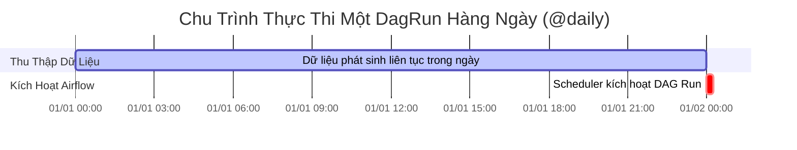

# 📌 Module 04: Scheduling, Data Intervals & Backfill

Module này giải thích chi tiết cơ chế định thời (Time & Scheduling) - một trong những khái niệm quan trọng nhất và thường gây nhầm lẫn nhất trong **Apache Airflow**.

---

## 🎯 Mục Tiêu Học Tập
1. Hiểu rõ sự khác biệt giữa **Logical Date (Execution Date)**, **Data Interval Start**, **Data Interval End** và **Run Date**.
2. Nắm vững nguyên lý: *Vì sao DAG theo lịch hàng ngày cho ngày `2024-01-01` chỉ thực sự được kích hoạt vào thời điểm `2024-01-02 00:00:00`?*
3. Cấu hình múi giờ chuẩn xác với thư viện **Pendulum** (`Asia/Ho_Chi_Minh`).
4. Cấu hình chính xác `catchup=True` vs `catchup=False` để tránh tạo ra bão tác vụ (Task Storm).
5. Sử dụng `max_active_runs` và `depends_on_past=True` để kiểm soát luồng xử lý chuỗi thời gian tuần tự (Time-series consistency).

---

## ⏰ Mô Hình Khoảng Thời Gian Dữ Liệu (Data Intervals)



```text
Trục thời gian thực tế:
┌─────────────────────────── Khoảng Dữ Liệu (Data Interval) ───────────────────────────┐
│                                                                                       ▼ (Trigger DAG Run)
2024-01-01 00:00:00                                                           2024-01-02 00:00:00
[ data_interval_start ]                                                      [ data_interval_end ]
[ logical_date / ds   ] ───────────────────────────────────────────────────▶ [ Thực thi DAG Run   ]
```

> **Quy Tắc Vàng**: Airflow luôn lập lịch cho khoảng thời gian *đã kết thúc*. Dữ liệu của ngày hôm nay chỉ đầy đủ sau khi ngày hôm nay đã kết thúc!

---

## 📂 Danh Sách Files & Chi Tiết Triển Khai

| File | Mô Tả & Khái Niệm Chính | Điểm Cốt Lõi |
| :--- | :--- | :--- |
| [`01_scheduling_and_intervals.py`](file:///c:/Users/Minh%20Doan/repo_github/Airflow/dags/04_scheduling_and_time/01_scheduling_and_intervals.py) | Khảo sát các biến ngữ cảnh thời gian trong task execution context (`logical_date`, `data_interval_start`, `data_interval_end`, `ds`). Gắn múi giờ `Asia/Ho_Chi_Minh` bằng Pendulum. | Hiểu sâu về logical date và trigger time. |
| [`02_backfill_and_catchup.py`](file:///c:/Users/Minh%20Doan/repo_github/Airflow/dags/04_scheduling_and_time/02_backfill_and_catchup.py) | Thiết lập kiểm soát `catchup=False`, điều phối `max_active_runs=1` và `depends_on_past=True` để đảm bảo chuỗi thời gian không bị đảo lộn. | Giữ tính toàn vẹn dữ liệu và đảm bảo Idempotency. |

---

## ⏱️ Bảng Tra Cứu Các Cron Presets Phổ Biến

| Preset | Tương Đương Biểu Thức Cron | Ý Nghĩa Thực Thi |
| :--- | :--- | :--- |
| `None` | Không lập lịch | Chỉ kích hoạt thủ công qua UI hoặc Trigger API |
| `@once` | Chạy đúng 1 lần | Chạy một lần duy nhất rồi tắt |
| `@hourly` | `0 * * * *` | Chạy mỗi đầu giờ |
| `@daily` | `0 0 * * *` | Chạy mỗi nửa đêm (00:00) |
| `@weekly` | `0 0 * * 0` | Chạy mỗi nửa đêm ngày Chủ Nhật |
| `@monthly` | `0 0 1 * *` | Chạy mỗi nửa đêm ngày đầu tháng |

---

## 🚀 Hướng Dẫn Kiểm Thử & Chạy Backfill CLI An Toàn

### 1. Kiểm tra cú pháp DAG
```bash
python dags/04_scheduling_and_time/01_scheduling_and_intervals.py
python dags/04_scheduling_and_time/02_backfill_and_catchup.py
```

### 2. Thực hiện lệnh Backfill dữ liệu lịch sử qua CLI
```bash
# Chạy bù dữ liệu an toàn từ 2024-01-01 đến 2024-01-05 với cờ --dry-run trước
airflow dags backfill \
    --start-date 2024-01-01 \
    --end-date 2024-01-05 \
    --dry-run \
    02_backfill_and_catchup

# Chạy thực tế và xóa trạng thái cũ nếu cần
airflow dags backfill \
    --start-date 2024-01-01 \
    --end-date 2024-01-05 \
    --reset-dagruns \
    02_backfill_and_catchup
```
