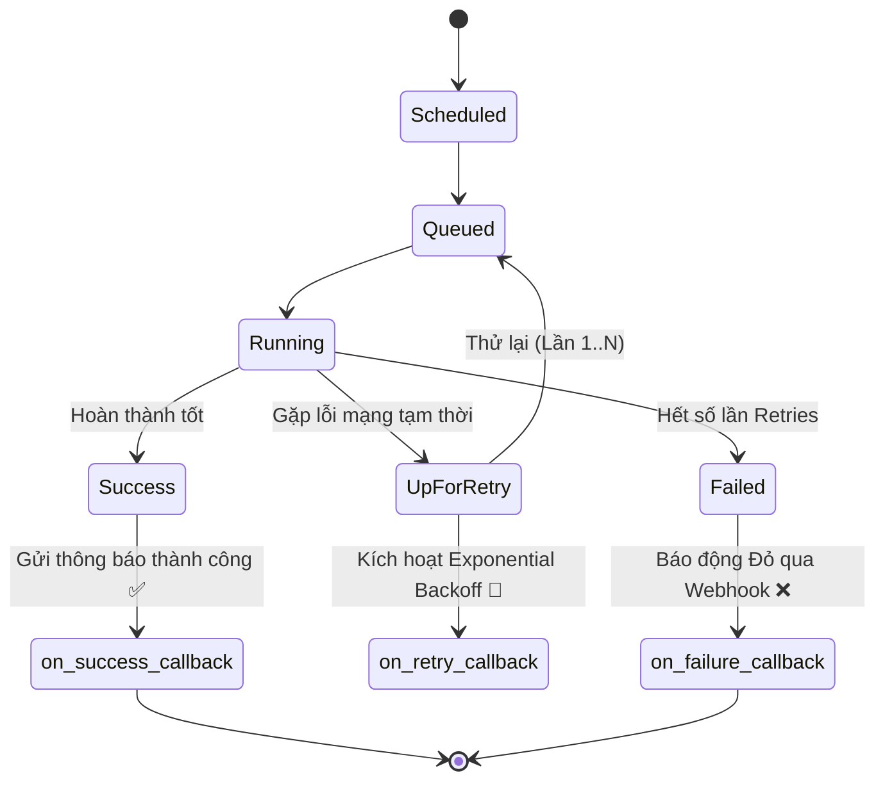

# 📌 Module 05: Monitoring, Resilience & Task Groups

Module này cung cấp các phương pháp chuẩn công nghiệp để xây dựng pipeline có khả năng chống chịu lỗi cao (Fault-tolerant), tích hợp cơ chế cảnh báo chủ động (Alerting) và cấu trúc giao diện DAG rõ ràng với **Task Groups**.

---

## 🎯 Mục Tiêu Học Tập
1. Thiết lập cơ chế tự phục hồi lỗi với `retries`, `retry_delay`, `retry_exponential_backoff`, và `max_retry_delay`.
2. Xây dựng hệ thống Callback thông minh: `on_failure_callback`, `on_success_callback`, `on_retry_callback` (tạo JSON payload tích hợp Webhook Slack/Discord/Teams).
3. Sử dụng **TaskGroup** lồng nhau (Nested Groups) để nhóm các bước xử lý liên quan (Extract, Transform, Load) giúp UI trực quan, tránh triệt để lỗi deadlock của mô hình SubDAG cũ.
4. Trích xuất metadata thực thi (`try_number`, `log_url`, `exception`) phục vụ truy vết sự cố nhanh chóng.

---

## 🔄 Vòng Đời Trạng Thái Task & Kích Hoạt Callbacks



---

## 📂 Danh Sách Files & Chi Tiết Triển Khai

| File | Mô Tả & Khái Niệm Chính | Điểm Cốt Lõi |
| :--- | :--- | :--- |
| [`01_retries_and_callbacks.py`](file:///c:/Users/Minh%20Doan/repo_github/Airflow/dags/05_monitoring_and_resilience/01_retries_and_callbacks.py) | Cấu hình thử lại hàm mũ cho tác vụ mạng rủi ro kết hợp các hàm xử lý Callback ghi log chi tiết lỗi khi có sự cố. | Tạo cấu trúc Payload chuẩn hóa gửi tới On-Call Data Engineer. |
| [`02_task_groups_ui.py`](file:///c:/Users/Minh%20Doan/repo_github/Airflow/dags/05_monitoring_and_resilience/02_task_groups_ui.py) | Gom nhóm các tác vụ thành `extract_sources_group`, `transform_data_group` (chứa các nhóm con `cleaning_subgroup`, `enrichment_subgroup`) và `load_dw_group`. | Tạo giao diện phân cấp trực quan, dễ mở rộng trên Airflow Graph View. |

---

## 🛡️ So Sánh: TaskGroup vs. SubDAG (Legacy)

| Tiêu Chí | SubDAG (Deprecated) | TaskGroup (Hiện đại, khuyên dùng) |
| :--- | :--- | :--- |
| **Cơ chế thực thi** | Là một DAG độc lập chạy bên trong DAG cha | Chỉ là thành phần tổ chức giao diện (UI Organization) |
| **Worker Slot** | Chiếm dụng slot của Executor gây Deadlock | Không chiếm dụng tài nguyên thực thi phụ |
| **Hiệu năng Scheduler** | Làm chậm quá trình phân tích DAG | Tối ưu hóa tối đa tốc độ quét DAG |
| **Độ phức tạp code** | Khó truyền XCom giữa cha và con | Truyền nhận dữ liệu tự nhiên như các task thông thường |

---

## 🚀 Hướng Dẫn Kiểm Thử & Thực Thi

### 1. Kiểm tra cú pháp DAG
```bash
python dags/05_monitoring_and_resilience/01_retries_and_callbacks.py
python dags/05_monitoring_and_resilience/02_task_groups_ui.py
```

### 2. Kiểm thử Callback giả lập
```bash
airflow tasks test 01_retries_and_callbacks resilient_api_call 2024-01-01
```
