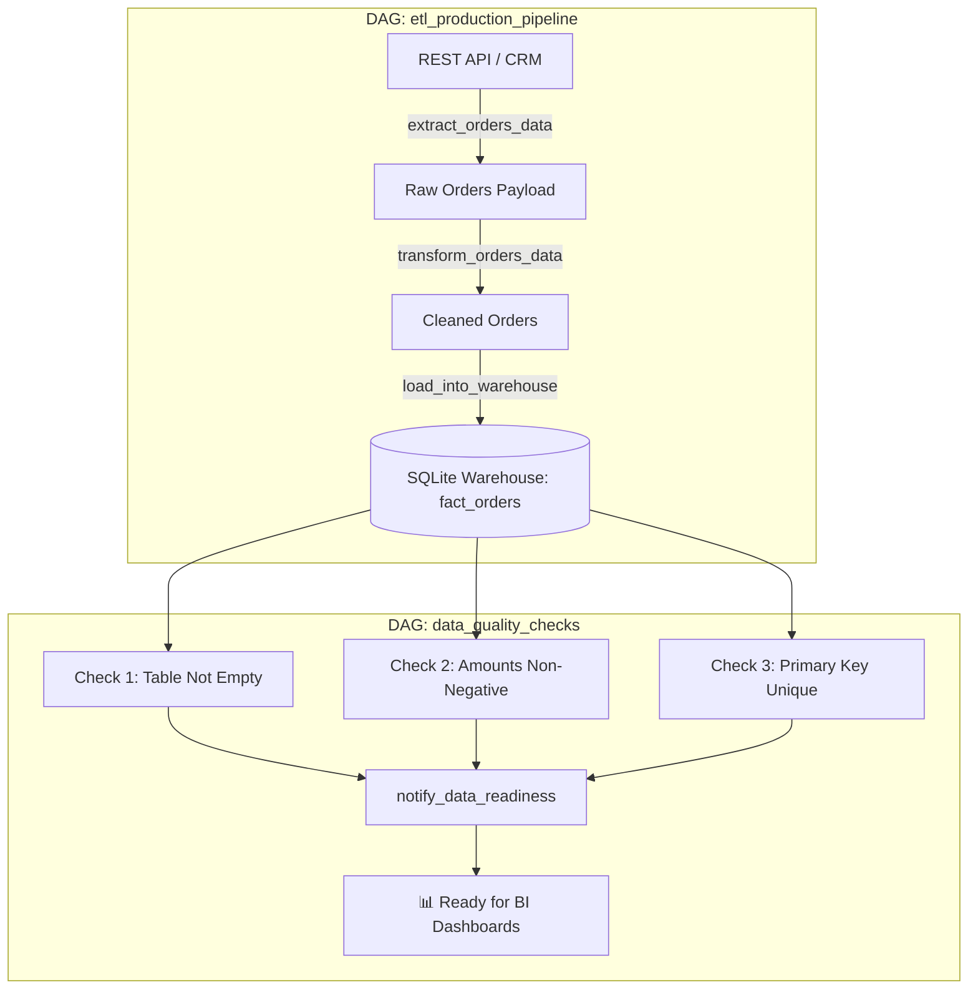

# 📌 Module 06: Production ETL Project & Data Quality Validation

Module này kết hợp toàn bộ các kỹ thuật đã học để xây dựng một hệ thống dữ liệu hoàn chỉnh đạt chuẩn Production: từ trích xuất, làm sạch, biến đổi dữ liệu, nạp vào Data Warehouse (SQLite) cho đến các chốt chặn kiểm định chất lượng dữ liệu (**Data Quality Checks**).

---

## 🎯 Mục Tiêu Học Tập
1. Xây dựng Data Pipeline hoàn chỉnh theo kiến trúc chuẩn **Extract -> Transform -> Load (ETL)**.
2. Xử lý làm sạch, chuẩn hóa kiểu dữ liệu, quy đổi tỷ giá ngoại tệ và lọc đơn hoàn tiền.
3. Thiết kế bảng Data Warehouse có tính chất **Idempotency (Tính bất biến/Nhập dữ liệu không trùng lặp)** bằng `INSERT OR REPLACE INTO` và Transaction Management (`commit` / `rollback`).
4. Thiết lập hệ thống **Data Quality Validation** độc lập với 3 trụ cột kiểm tra:
   - **Completeness**: Kiểm tra bảng không bị rỗng (`check_table_not_empty`).
   - **Validity**: Kiểm tra giá trị hợp lệ, không âm (`check_no_negative_amounts`).
   - **Uniqueness**: Kiểm tra khóa chính không bị trùng lặp (`check_primary_key_uniqueness`).

---

## 🏗️ Luồng Xử Lý Kiến Trúc (Architecture Pipeline)



---

## 📂 Danh Sách Files & Chi Tiết Triển Khai

| File | Mô Tả & Khái Niệm Chính | Điểm Cốt Lõi |
| :--- | :--- | :--- |
| [`etl_production_pipeline.py`](file:///c:/Users/Minh%20Doan/repo_github/Airflow/dags/06_production_etl_project/etl_production_pipeline.py) | Pipeline chính: Trích xuất đơn hàng từ API -> Quy đổi USD sang VND -> Nạp vào bảng `fact_orders` trong SQLite Warehouse với đường dẫn tương thích đa nền tảng (`tempfile`). | Hỗ trợ Transaction commit/rollback và Upsert an toàn. |
| [`data_quality_checks.py`](file:///c:/Users/Minh%20Doan/repo_github/Airflow/dags/06_production_etl_project/data_quality_checks.py) | Pipeline kiểm định chất lượng: Kiểm tra bảng không rỗng, doanh thu không âm, và không trùng lặp `order_id`. | Ngăn chặn dữ liệu hỏng rò rỉ sang lớp phục vụ báo cáo phân tích. |

---

## 🚀 Hướng Dẫn Kiểm Thử & Thực Thi

### 1. Kiểm tra cú pháp DAG
```bash
python dags/06_production_etl_project/etl_production_pipeline.py
python dags/06_production_etl_project/data_quality_checks.py
```

### 2. Kích hoạt và kiểm tra kết quả trong SQLite
```bash
# Kích hoạt chạy DAG ETL trước
airflow dags trigger etl_production_pipeline

# Kích hoạt chạy DAG kiểm định chất lượng dữ liệu
airflow dags trigger data_quality_checks
```
