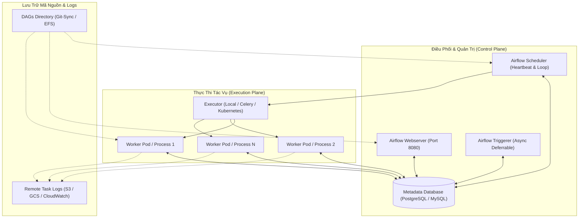
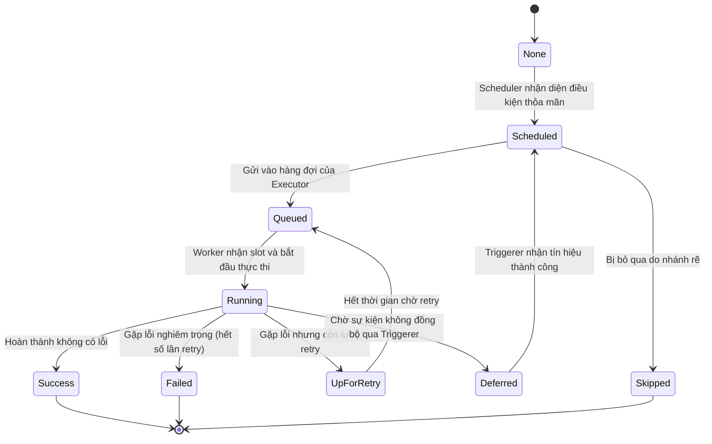

# 🏛️ Kiến Trúc Tổng Quan Của Apache Airflow

Apache Airflow là nền tảng mã nguồn mở hàng đầu thế giới được xây dựng để lập lịch, điều phối và giám sát các luồng dữ liệu (Data Pipelines / Workflows) theo mô hình đồ thị có hướng không chu trình (**DAG - Directed Acyclic Graph**).

---

## 1. Sơ Đồ Kiến Trúc Hệ Thống (End-to-End Architecture)

---

## 2. Các Thành Phần Cốt Lõi (Core Daemons)

### 2.1. Airflow Webserver
- Cung cấp giao diện đồ họa Web UI trực quan (Flask App).
- Cho phép người dùng theo dõi đồ thị Grid View, Graph View, Gantt Chart, kiểm tra Logs theo thời gian thực.
- Quản lý cấu hình toàn cục: Airflow Variables, Connections bảo mật, Pools tài nguyên, SLA Misses và quyền truy cập RBAC (Role-Based Access Control).

### 2.2. Airflow Scheduler
- **"Bộ não điều hành"** của toàn bộ cụm Airflow.
- Chạy vòng lặp vô tận thực hiện các tác vụ:
  1. Quét định kỳ thư mục `dags/` (DAG File Processor Loop).
  2. Phân tích cú pháp Python thành cấu trúc DAG đối tượng và lưu dạng tuần tự hóa (Serialized DAGs) vào Metadata Database.
  3. Kiểm tra các mốc thời gian (Data Interval End) và sinh ra `DagRun` với trạng thái `QUEUED` / `RUNNING`.
  4. Đánh giá phụ thuộc các Task, đẩy các TaskInstance đủ điều kiện sang hàng đợi của Executor.

### 2.3. Metadata Database
- Lưu trữ toàn bộ trạng thái hệ thống: Danh sách DAGs, lịch sử thực thi, Task Instances, XComs, Connections, Variables, Người dùng và Quyền hạn.
- **Khuyến nghị môi trường Production**: Luôn sử dụng **PostgreSQL** hoặc **MySQL**. Tuyệt đối không dùng SQLite trong môi trường thực tế vì SQLite khóa toàn bộ file khi ghi, không hỗ trợ đa tiến trình đồng thời.

### 2.4. Executor & Worker Nodes
- **Executor**: Cơ chế logic xác định *cách thức* phân phối task (chạy ngay trên tiến trình cục bộ hay đẩy qua message queue).
- **Workers**: Các tiến trình hoặc Container/Pod trực tiếp nạp mã nguồn Python của task và thực thi tác vụ tính toán.

### 2.5. Triggerer & Deferrable Operators (Airflow 2.2+)
- Tiến trình nền không đồng bộ (`asyncio`) chuyên trách lắng nghe các sự kiện bên ngoài mà không cần chiếm slot của Worker.
- Khi gặp Deferrable Operator (hoặc Sensor ở dạng deferred), task tạm thời nhả slot worker và chuyển quyền lắng nghe cho Triggerer. Khi sự kiện kích hoạt thành công, Triggerer báo lại cho Scheduler để đưa task trở lại hàng đợi.
- **Lợi ích**: Tiết kiệm tới **80% - 90% chi phí tài nguyên điện toán** cho các pipeline chờ đợi dữ liệu dài hạn.

---

## 3. Vòng Đời Trạng Thái Của Task (Task Instance Lifecycle)

