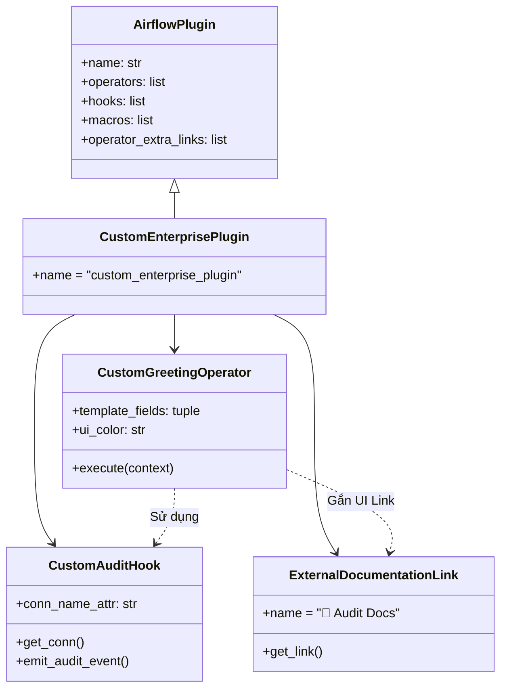

# 🔌 Module Plugins: Airflow Plugin Architecture

Thư mục `plugins/` là nơi chứa các thành phần mở rộng tùy chỉnh cho Apache Airflow như **Custom Operators**, **Custom Hooks**, **Custom Sensors**, **Custom Macros**, và **Operator Extra Links**.

---

## 🎯 Mục Tiêu Học Tập
1. Hiểu cơ chế nạp plugin tự động của Airflow từ thư mục `plugins/` khi Scheduler và Webserver khởi động.
2. Xây dựng **Custom Hook** kế thừa từ `BaseHook` để đóng gói logic kết nối hoặc ghi log kiểm toán (Audit Trail).
3. Xây dựng **Custom Operator** kế thừa từ `BaseOperator` có template fields, `ui_color` và liên kết trực tiếp với Hook.
4. Triển khai **`BaseOperatorLink`** để tạo nút liên kết ngoài (External Docs/Logs button) trực tiếp trên Web UI.
5. Đăng ký hàm Jinja Macro tùy biến (`macros`) và đóng gói plugin với lớp `AirflowPlugin`.

---

## 🧩 Kiến Trúc Đóng Gói Plugin Phân Tầng



---

## 📂 Danh Sách Thành Phần Triển Khai

| Thành Phần | Lớp / Hàm | Ý Nghĩa Thực Tế |
| :--- | :--- | :--- |
| **Custom Hook** | `CustomAuditHook(BaseHook)` | Đóng gói tương tác với hệ thống quản lý nhật ký kiểm toán và xác thực bảo mật. |
| **Custom Operator** | `CustomGreetingOperator(BaseOperator)` | Toán tử thực thi logic và gọi Hook phát sự kiện kiểm toán. Hỗ trợ `template_fields`. |
| **Operator Extra Link** | `ExternalDocumentationLink(BaseOperatorLink)` | Thêm nút bấm trực quan trên Airflow UI trỏ tới tài liệu hoặc hệ thống giám sát ngoài. |
| **Custom Macro** | `format_filesize_bytes(size)` | Hàm hỗ trợ định dạng dung lượng byte sang KB/MB/GB trong các biểu thức Jinja. |
| **Plugin Packaging** | `CustomEnterprisePlugin(AirflowPlugin)` | Điểm đăng ký trung tâm để Airflow Plugin Manager nhận diện toàn bộ module. |

---

## 🚀 Cách Sử Dụng Trong DAG & Kiểm Tra CLI

### 1. Sử dụng trong DAG
```python
from airflow import DAG
from datetime import datetime
from custom_plugins import CustomGreetingOperator

with DAG(dag_id="test_custom_plugin", start_date=datetime(2024, 1, 1), schedule=None) as dag:
    greet = CustomGreetingOperator(
        task_id="greet_engineer",
        recipient_name="Data Engineer {{ ds }}",
        message="Xin chào",
        audit_note="Production Daily Verification",
    )
```

### 2. Kiểm tra danh sách Plugin đã nạp qua CLI
```bash
airflow plugins
```
Lệnh trên sẽ hiển thị `custom_enterprise_plugin` cùng danh sách các Hooks, Operators và Extra Links tương ứng.
